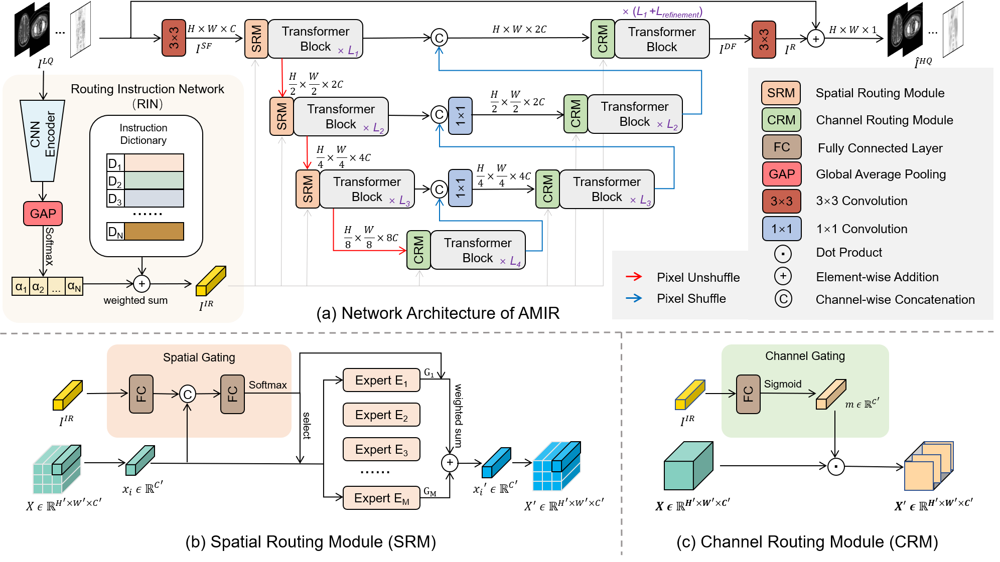
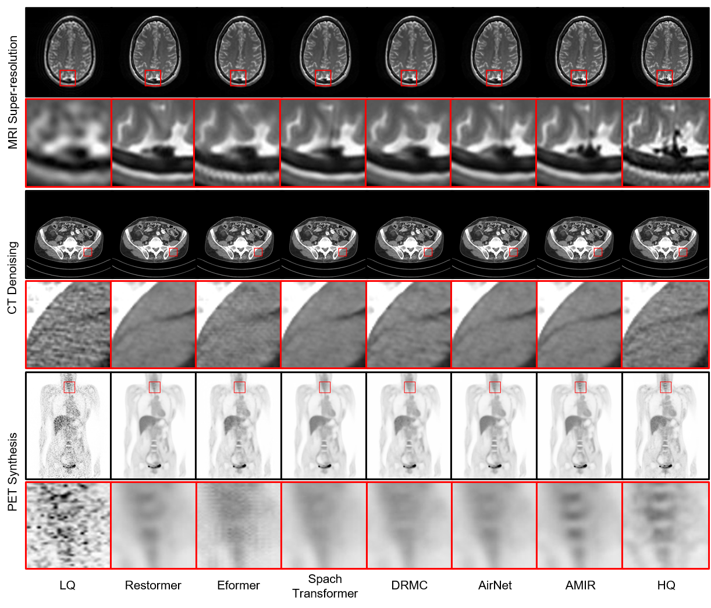

# All-In-One Medical Image Restoration via Task-Adaptive Routing (AMIR)

PyTorch implementation for [All-In-One Medical Image Restoration via Task-Adaptive Routing](https://arxiv.org/abs/2405.19769) (AMIR) (MICCAI 2024).

## Network Architecture



## Dataset

You can download the preprocessed datasets for MRI super-resolution, CT denoising, and PET synthesis from Baidu Netdisk [here](https://pan.baidu.com/s/1oBBG_Stcn7cfO8U49S146w?pwd=3x13 ).

The original dataset for MRI super-resolution and CT denoising are as follows:

- MRI super-resolution: [IXI dataset](http://brain-development.org/ixi-dataset/)

- CT denoising: [AAPM dataset](https://www.aapm.org/grandchallenge/lowdosect/)

## Visualization

You can use [AMIDE](https://amide.sourceforge.net/) to visualize the ".nii" file. Note that the color map for MRI and CT images is "black/white linear," while the color map for PET images is "white/black linear." Additionally, you need to rescale the PET image according to the voxel size specified in the paper.



## Citation

If you find AMIR useful in your research, please consider citing:

```bibtex
@misc{yang2024allinone,
      title={All-In-One Medical Image Restoration via Task-Adaptive Routing}, 
      author={Zhiwen Yang and Haowei Chen and Ziniu Qian and Yang Yi and Hui Zhang and Dan Zhao and Bingzheng Wei and Yan Xu},
      year={2024},
      eprint={2405.19769},
      archivePrefix={arXiv},
      primaryClass={cs.CV}
}
```

